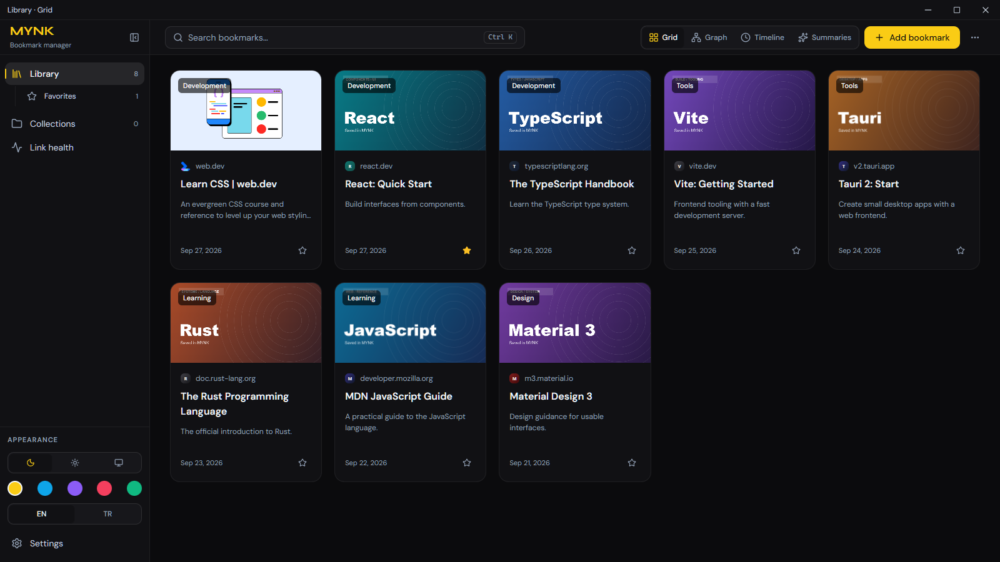
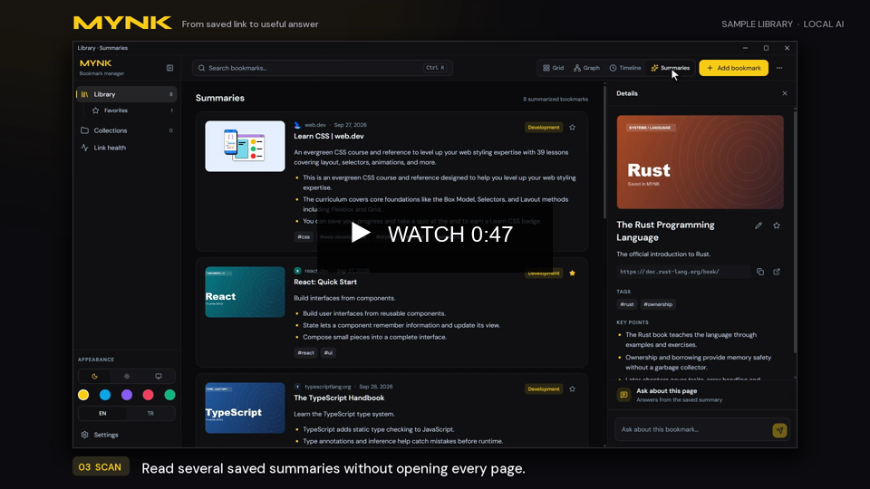
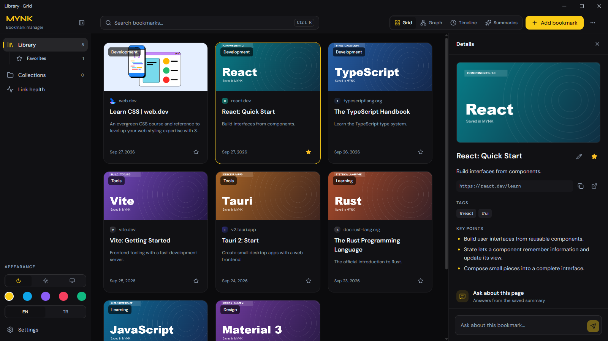
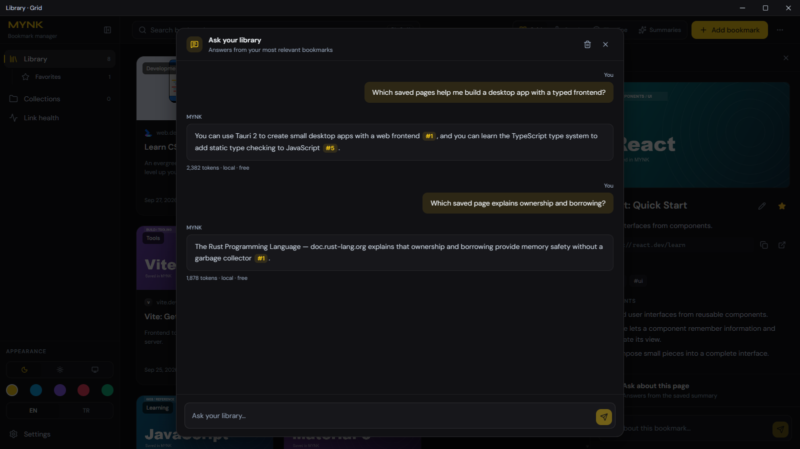
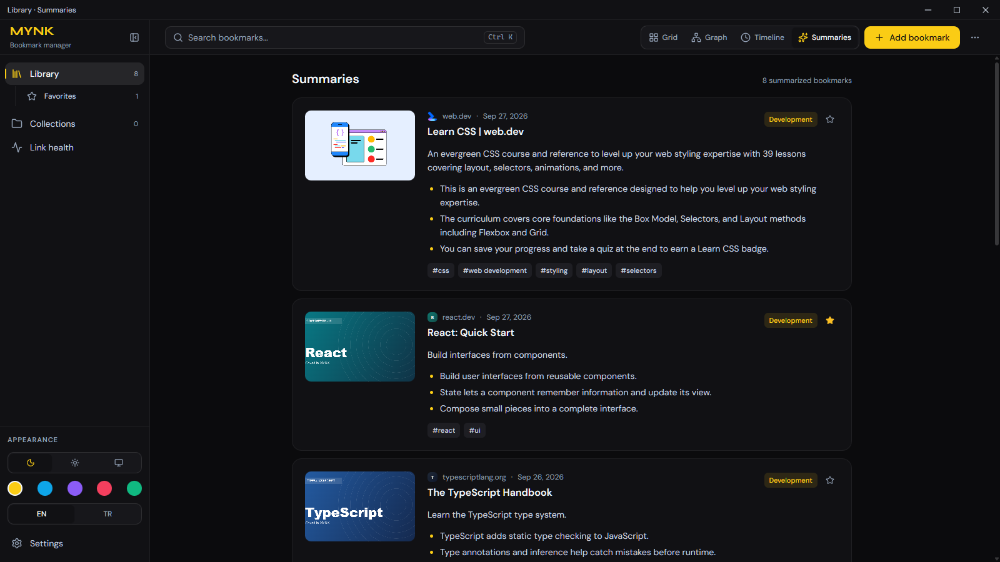
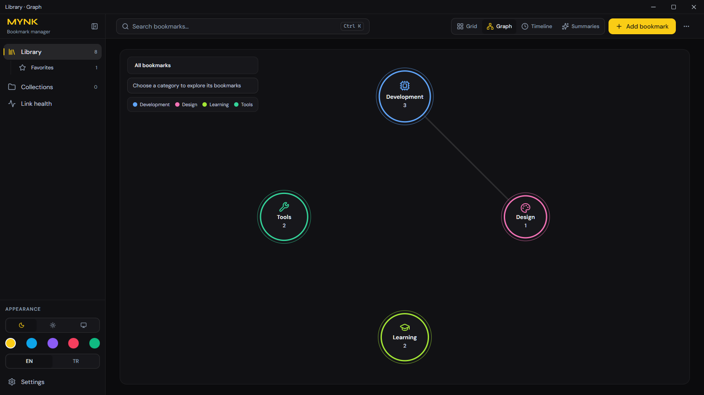
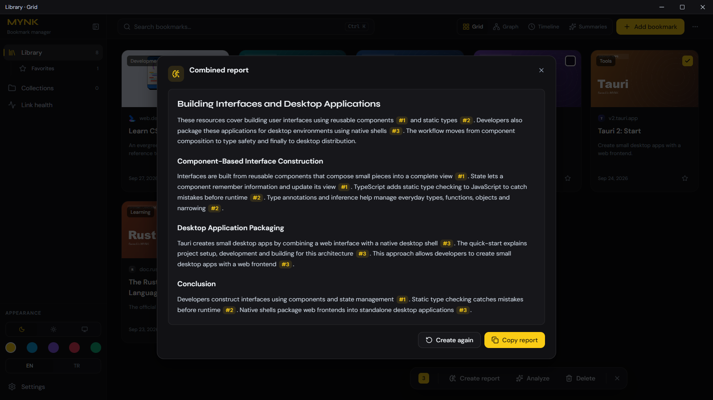
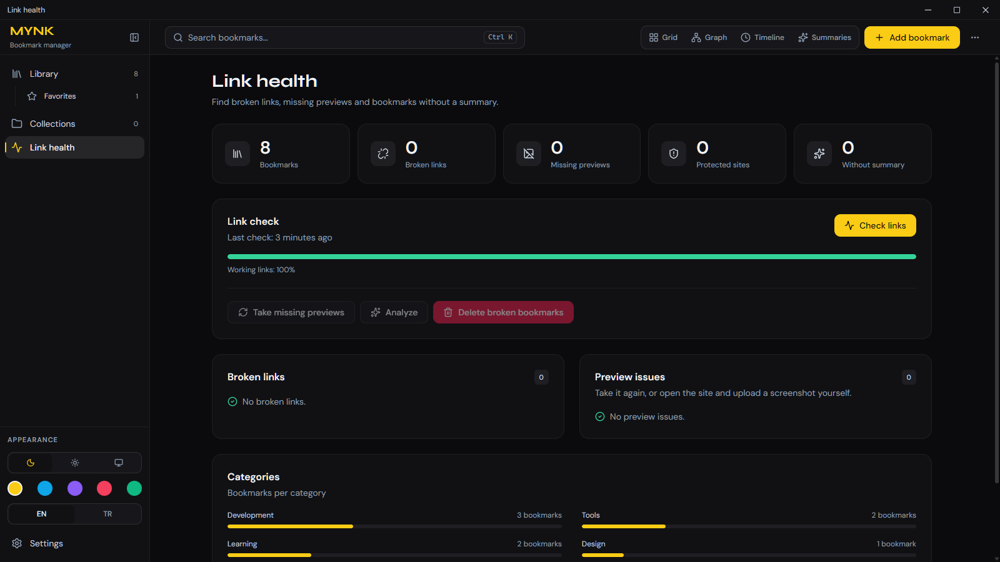

# MYNK

[English](README.md) | Türkçe

MYNK, kaydettiğin sayfaları özet, kategori, etiket ve önizlemelerle aranabilir bir kütüphaneye
dönüştürür. Bir sayfayı içeriğinden bulabilir veya kütüphanene soru sorup kaynaklı cevaplar alabilirsin.

Ollama ile yerel, OpenRouter ile bulut modeli kullanabilirsin. MCP köprüsü sayesinde ajanlar da yer
imlerini arayabilir, okuyabilir ve kütüphaneye bağlantı ekleyebilir.

## Önizleme

Görseller örnek bir kütüphaneden alındı. Tam boy görmek için görsele tıkla.

<table>
  <tr>
    <td align="center"><a href="docs/media/library.png"></a><br><sub>Kütüphane</sub></td>
    <td align="center"><a href="docs/media/mynk-usage.mp4"></a><br><sub>Video · 47 saniye · İngilizce</sub></td>
  </tr>
  <tr>
    <td align="center"><a href="docs/media/details.png"></a><br><sub>Yer imi ayrıntıları</sub></td>
    <td align="center"><a href="docs/media/chat.png"></a><br><sub>Kütüphanene sor · kaynaklı cevaplar</sub></td>
  </tr>
</table>

<details>
<summary>Diğer görünümler: özetler, ağ, raporlar ve bağlantı sağlığı</summary>

<table>
  <tr>
    <td align="center"><a href="docs/media/summaries.png"></a><br><sub>Özetler</sub></td>
    <td align="center"><a href="docs/media/graph.png"></a><br><sub>Ağ</sub></td>
  </tr>
  <tr>
    <td align="center"><a href="docs/media/report.png"></a><br><sub>Ortak rapor</sub></td>
    <td align="center"><a href="docs/media/health.png"></a><br><sub>Bağlantı sağlığı</sub></td>
  </tr>
</table>
</details>

## Özellikler

- Chrome, Edge, Brave, Vivaldi, Opera ve Firefox'tan, HTML yer imi dosyasından ya da Chrome/Chromium
  `Bookmarks` dosyasından içe aktarma
- Sayfa özeti, kategori ve etiketler; hepsini düzenleyebilirsin
- Başlık, özet, etiket ve adreste arama
- Koleksiyonlar ve favoriler
- Izgara, özetler, zaman çizelgesi ve ağ görünümleri
- Kütüphanene sor, seçtiğin yer imlerinden ortak rapor
- Kırık bağlantı kontrolü
- Sayfa önizlemeleri
- Tam yedek alma ve geri yükleme
- MCP sunucusu

## Arama ve sohbet nasıl çalışır

Arama kutusu başlık, açıklama, adres, etiket ve özette metin arar. AI modeli kullanmaz.

Kütüphanene sor, sorduğun sorudaki kelimelerle eşleşen en fazla 15 yer imini seçer ve özetlerini
sohbet modeline gönderir. En yeni üç yer imi ve her birinin eklenme tarihi her zaman gider. Hiçbir
kelime eşleşmezse en yeni 15 yer imini gönderir. Model cevabı yazar, kaynakları `[#n]` olarak
gösterir. Ortak rapor aynı şeyi seçtiğin yer imleriyle yapar. İkisi için de yalnız sohbet modeli
gerekir.

Ajan köprüsü (`mynk-mcp`) anlama göre de arayabilir. Bunun için Ollama'da bir gömme (embedding)
modeli gerekir: Ayarlar, AI sağlayıcısı bölümünden seç ya da Otomatik bırak. Model yoksa ajan
kelimeyle arar. Gömme modeli isteğe bağlıdır; uygulama içindeki arama ve sohbet için gerekli değildir.

## Diller

Arayüz Türkçe ve İngilizce. Yeni bir dil eklemek için
[CONTRIBUTING.md](CONTRIBUTING.md#adding-a-language) dosyasındaki adımları izle.

## Kurulum

Windows 10/11 kurulum dosyası [Releases](https://github.com/SKBv0/mynk/releases/latest) sayfasında.
Yönetici izni gerekmez.

Kurulum dosyası henüz imzasız, bu yüzden SmartScreen uyarı verir. **Ek bilgi → Yine de çalıştır**'a
tıkla. Sonraki güncellemeler uygulamanın içinden kurulur.

Linux ve macOS için kurulum dosyası yok, [kaynaktan derleyebilirsin](#kaynaktan-derleme). macOS'ta
denenmedi.

Kurduktan sonra Ayarlar'da **AI sağlayıcısı** sekmesinden bir model seç, **Veri** sekmesinden yer
imlerini içe aktar.

## MCP

`mynk-mcp` uygulamayla birlikte kurulur. Ayarlar'daki **Ajanlar** sekmesinde Claude Code, Codex,
Cursor ve Windsurf için hazır ayar var. Başka bir istemci için oradaki JSON'u kopyala.

Başlıca araçlar `search_bookmarks`, `get_bookmark`, `list_recent` ve `add_bookmark`. Tam liste
[docs/mcp.md](docs/mcp.md) dosyasında.

Ajanın eklediği bağlantılar önce bir gelen kutusu klasörüne düşer. MYNK açıksa onları on saniye
kadar içinde alır ve analiz eder; analiz birkaç dakika sürebilir. MYNK kapalıysa bu bir sonraki
açılışta olur.

## Gizlilik

Kütüphane bilgisayarında, `%APPDATA%\com.mynk.desktop\library.json` dosyasında durur. Hesap
gerekmez, kullanım verisi toplanmaz.

Bilgisayarından çıkan veriler ve gittikleri yerler:

- **Kaydettiğin siteler.** MYNK analiz, bağlantı kontrolü ve önizleme için her yer iminin sayfasını
  kendi sitesinden ister.
- **Sayfanın gösterdiği diğer adresler.** MYNK site simgelerini ve önizleme görsellerini sayfanın
  verdiği adresten indirir. Bu adres çoğu zaman bir CDN'dir.
- **AI sağlayıcın.** Analiz, sayfa metnini ve adresini gönderir. Kütüphanene sor ve ortak rapor,
  ilgili yer imlerinin başlıklarını, adreslerini, etiketlerini, özetlerini ve temel noktalarını
  sorularınla birlikte gönderir. Ollama kullanırsan bunlar Ayarlar'daki Ollama adresine gider; bu
  adres genelde kendi bilgisayarındır. OpenRouter kullanırsan OpenRouter'a gider, OpenRouter da
  modelin sağlayıcısına iletir.
- **example.com.** Bağlantı sağlığı taraması, "internet yok" ile "site kapalı" durumunu ayırmak için
  DNS'te `example.com` adresine bakar.
- **GitHub.** MYNK günde bir kez bu deponun Releases sayfasında yeni sürüm var mı diye bakar.

MYNK önizleme alırken ve düz indirmeyle okunamayan sayfaları analiz ederken sayfayı bilgisayarındaki
Chrome ya da Edge ile arka planda açar. Sayfanın betikleri orada çalışır ve sayfa istediği diğer
dosyaları normal bir ziyaretteki gibi yükler. Tarayıcı, iş bitince silinen geçici bir profil
kullanır.

## Kaynaktan derleme

Node.js 24+, Rust (rustup) ve sistemin için derleme araçları gerekir (Windows'ta Visual Studio Build
Tools, Linux'ta Tauri kütüphaneleri). Ayrıntılar [CONTRIBUTING.md](CONTRIBUTING.md) dosyasında.

```bash
npm install
npm run build:mcp
npm run tauri:dev
```

`npm run build:mcp`, ajan köprüsünün kullandığı `mynk-mcp` dosyasını derler. MCP'ye ihtiyacın yoksa
bu adımı atlayabilirsin; uygulama yine çalışır.

## Katkı

[CONTRIBUTING.md](CONTRIBUTING.md) dosyasına bak. Bir güvenlik sorununu bildirmek için
[SECURITY.md](SECURITY.md) dosyasını oku.

## Lisans

[MIT](LICENSE)
